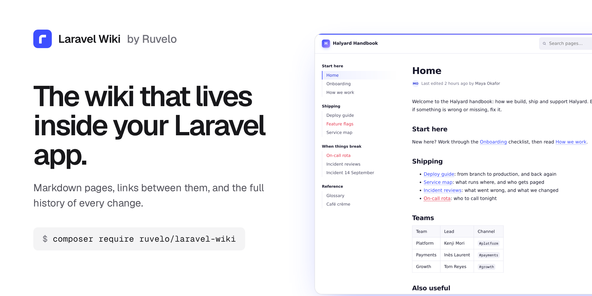
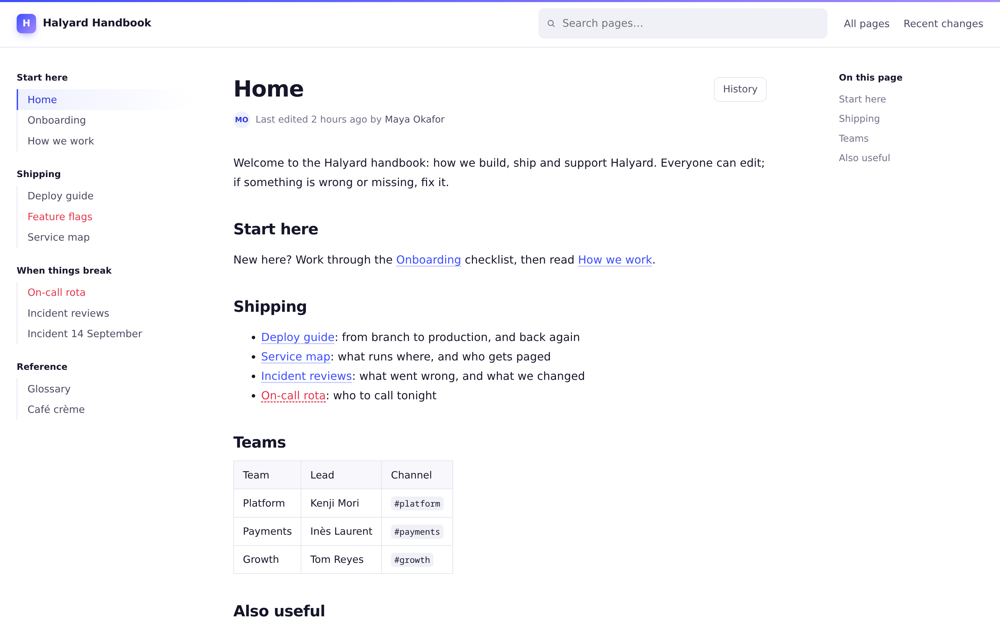
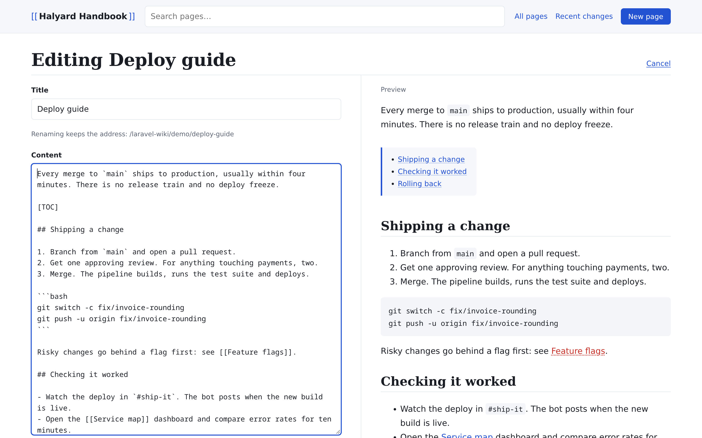
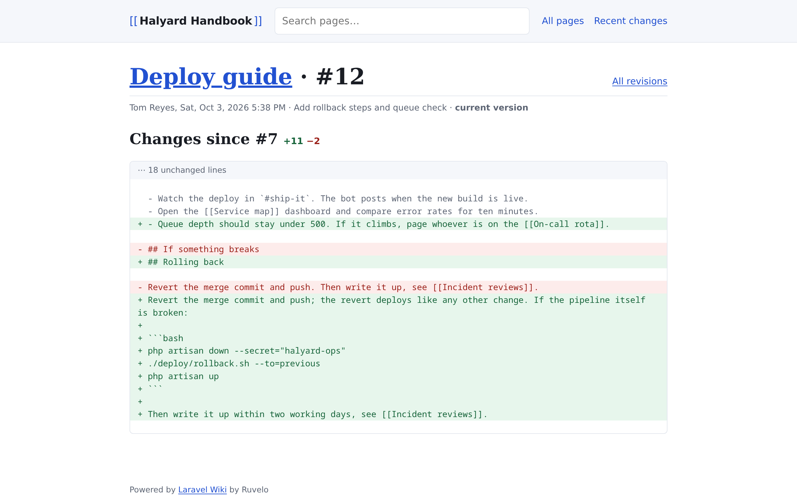
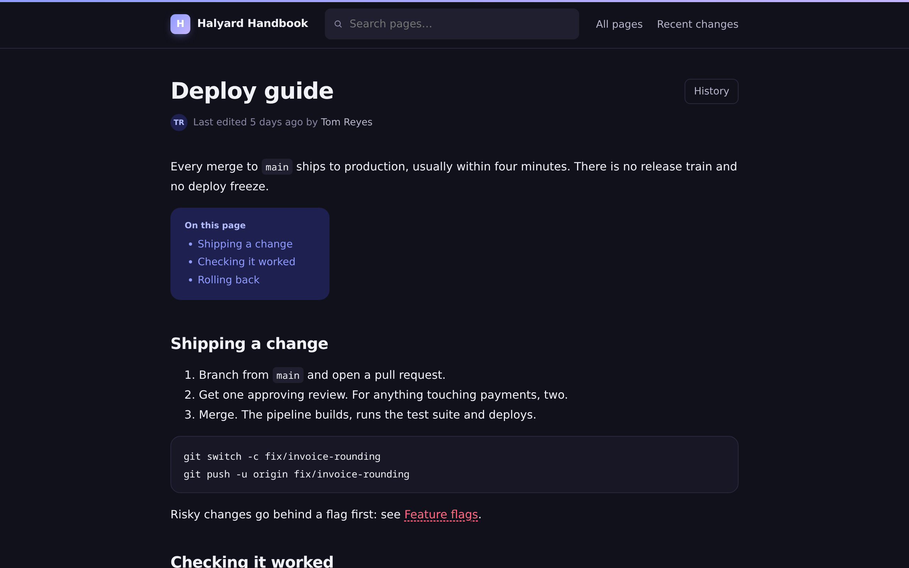
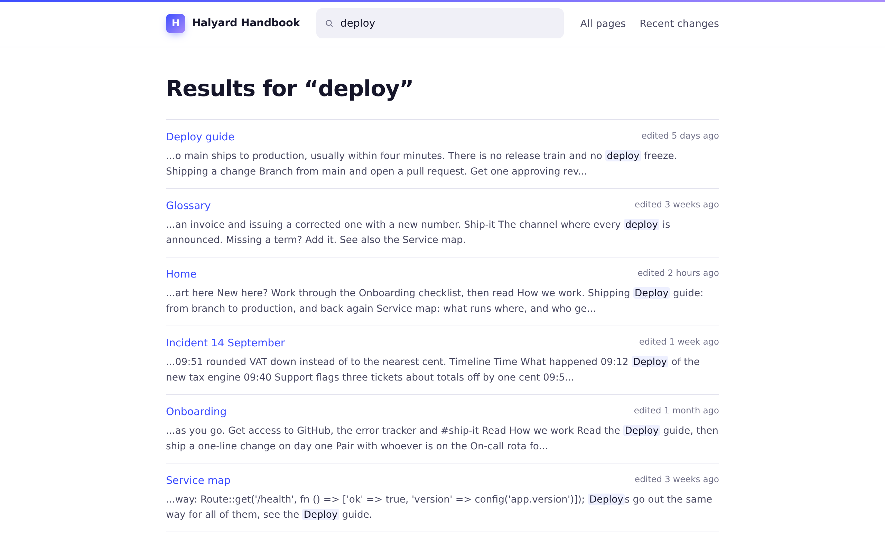

<p align="center">
  <a href="https://ruvelo.github.io/laravel-wiki/"></a>
</p>

<p align="center">
  <a href="https://ruvelo.github.io/laravel-wiki/"><strong>Live demo</strong></a> &nbsp;&nbsp;&nbsp;
  <a href="#configuration"><strong>Configuration</strong></a> &nbsp;&nbsp;&nbsp;
  <a href="#for-developers"><strong>Developer guide</strong></a> &nbsp;&nbsp;&nbsp;
  <a href="CHANGELOG.md"><strong>Changelog</strong></a>
</p>

<p align="center">
  <a href="https://github.com/Ruvelo/laravel-wiki/actions/workflows/tests.yml"></a>
  
  
  
  <a href="LICENSE"></a>
</p>

# Laravel Wiki

**A drop-in wiki for your Laravel app.** Markdown pages, `[[links]]` between them, and the full history of every change. It runs on your database and your logins, with no frontend build step and no extra services.

```
composer require ruvelo/laravel-wiki
php artisan migrate
```

Then open `/wiki`. Or click around the [live demo](https://ruvelo.github.io/laravel-wiki/) first.

## A quick tour



**Pages link to each other.** Write `[[Deploy guide]]` and it becomes a link. Pages that don't exist yet show in red, an open invitation to whoever knows the answer.



**Edit with a live preview.** Markdown on the left, the finished page on the right, updated as you type.



**Every save is kept.** See what changed, who changed it, and put any old version back in one click.

<table>
  <tr>
    <td width="50%"></td>
    <td width="50%"></td>
  </tr>
  <tr>
    <td><strong>Light and dark</strong>, following each reader's system setting.</td>
    <td><strong>Search</strong> with highlighted snippets; an exact title takes you straight to the page.</td>
  </tr>
</table>

## Features

- **Markdown, GitHub-style**: headings, tables, task lists, fenced code, autolinks and strikethrough. Put `[TOC]` on its own line to get a table of contents.
- **Wiki links**: `[[Deploy guide]]` or `[[Deploy guide|how we ship]]`. A link to a page that doesn't exist yet shows in red; for editors it opens the create form with the title filled in.
- **Docs-style layout**: a menu on the left, the page in the middle and its outline on the right, like the Laravel docs. The menu is a page called *Sidebar* that editors maintain: headings become groups, `[[links]]` become items. Without it, the menu lists every page.
- **What links here**: every page lists the pages that link to it.
- **Every save is a revision**: browse a page's history, see a line-by-line diff of each change, and restore any old version. A restore is itself a revision, so it can be undone.
- **No lost edits**: if someone saves a page while you're editing it, your save is refused rather than overwriting theirs, and your text stays in the editor.
- **Live preview** beside the editor, updated as you type.
- **Search** across titles and content, with highlighted snippets.
- **Recent changes** across the whole wiki.
- **Safe to render**: raw HTML in the source is escaped and `javascript:` links are dropped. People with edit rights can't inject scripts.
- **Readable URLs in any language**: `Café Crème` → `/wiki/café-crème`, `日本語` → `/wiki/日本語`.
- **Light and dark mode** following the system setting, readable at phone width.
- **A knowledge source for AI agents**: an optional MCP server lets Claude, Cursor and other agents search and read the wiki, and edit it if you allow. Coding agents using [Laravel Boost](https://laravel.com/docs/boost) also learn how to use the package correctly.

## Requirements

- PHP 8.3+
- Laravel 12 or 13
- Any database Laravel supports (tested on SQLite; plain SQL that also suits MySQL, MariaDB and Postgres)

## Who can edit

By default, **anyone can read and any signed-in user can edit.** To narrow that, define a `wiki-edit` gate, for example in your `AppServiceProvider`:

```php
use Illuminate\Support\Facades\Gate;

Gate::define('wiki-edit', fn ($user) => $user->is_admin);
```

To make the whole wiki private, wrap every route in `auth` through the config:

```php
'middleware' => ['web', 'auth'],
```

## Configuration

Publish the config file if you want to change the defaults:

```
php artisan vendor:publish --tag=wiki-config
```

| Key | Default | |
|---|---|---|
| `name` | `Wiki` (`WIKI_NAME`) | Shown in the header and page titles |
| `path` | `wiki` (`WIKI_PATH`) | URL prefix |
| `domain` | `null` | Serve the wiki on its own (sub)domain |
| `middleware` | `['web']` | Applied to every route |
| `edit_middleware` | `[]` | Extra middleware for create/edit/delete/restore (signing in is always required) |
| `home` | `home` | Slug shown at the wiki root |
| `sidebar` | `sidebar` | Slug of the page used as the left menu; `null` for an automatic list |
| `table_prefix` | `wiki_` | Tables are `{prefix}pages`, `{prefix}revisions`, `{prefix}links` |
| `run_migrations` | `true` | Set to `false` if you publish and manage the migration yourself |
| `user_model` | your `users` provider model | Who revisions are attributed to |
| `user_name_attribute` | `name` | Shown as the author in the history |
| `per_page` | `50` | Page size for lists and search |
| `routes` | `true` | Set to `false` to register routes yourself (copy `routes/web.php`) |
| `api.enabled` | `false` (`WIKI_API`) | Turn on the JSON API |
| `api.prefix` | `api/wiki` | Where the JSON API lives |
| `api.middleware` | `['api', 'auth:sanctum']` | Applied to every API route |
| `mcp.enabled` | `false` (`WIKI_MCP`) | Turn on the MCP server for AI agents (needs `laravel/mcp`) |
| `mcp.path` | `mcp/wiki` | The MCP HTTP endpoint; `null` for none |
| `mcp.middleware` | `['auth:sanctum']` | Applied to the MCP endpoint. Use a token guard: agents can't hold a session |
| `mcp.local` | `wiki` | Handle for `php artisan mcp:start wiki`; `null` for none |
| `mcp.local_user` | `null` (`WIKI_MCP_USER`) | User id the local server acts as; a guest otherwise |
| `mcp.allow_writes` | `false` (`WIKI_MCP_WRITES`) | Offer the `write_page` tool (still needs the `wiki-edit` gate) |
| `markdown.extensions` | `[]` | Extra CommonMark extensions |
| `markdown.options` | `[]` | CommonMark options, merged over the defaults |

## Making it look like your app

The views are plain Blade with the styles inlined in one layout. Publish them and edit as you like:

```
php artisan vendor:publish --tag=wiki-views
```

They land in `resources/views/vendor/wiki`. Every page extends `layout.blade.php`, so swapping that one file for your own layout is enough to put the wiki inside your app's chrome. Each page fills a `content` section and a `title` section. The layout also has a `wiki-head` stack for extra `<head>` tags, and colors are CSS variables (`--wiki-accent` and friends) at the top of the layout.

## Use it from AI agents

The wiki can be a knowledge source for AI agents: Claude Code, Claude Desktop, Cursor, ChatGPT or anything else that speaks the [Model Context Protocol](https://modelcontextprotocol.io). Ask "how do refunds work?" and the agent searches the wiki, reads the right pages and cites them.

It's built on [Laravel MCP](https://laravel.com/docs/mcp), which the wiki suggests but doesn't require. To turn it on:

```
composer require laravel/mcp
```

```ini
WIKI_MCP=true
```

Agents get these tools:

| Tool | Does |
|---|---|
| `search_pages` | Search titles and text: titles, slugs, a snippet around the match, URLs |
| `read_page` | One page by slug or title: Markdown body, title, URL, last update, current revision, the pages it links to and the pages linking to it |
| `list_pages` | Every page alphabetically, paginated |
| `recent_changes` | The latest edits with their summaries and authors, for the whole wiki or one page |
| `write_page` | Create or update a page with an edit summary. Only when you allow writes (below) |

Every page is also a resource, `wiki://pages/{slug}`, with slug completion, so clients that let you attach resources can pull a page into the conversation.

**Who can see what.** The endpoint is `/mcp/wiki`, behind `auth:sanctum` by default (set `wiki.mcp.middleware` for another guard). The wiki has no per-page permissions, so anyone who gets through that middleware can read every page, just as anyone who can open `/wiki` can. If your web wiki is private, keep the MCP guard at least as strict.

**Writing is off by default.** Set `WIKI_MCP_WRITES=true` to offer `write_page`. Agents then edit like people do: they need a signed-in user who passes the `wiki-edit` gate, each save is a revision with a summary (so it can be diffed and undone in the history), and an update must name the revision it was based on. If someone saved the page in the meantime, the write is refused and the agent is told to read it again and merge. An agent can't overwrite a page it hasn't read.

### Connect a client

Create a token for the user the agent acts as (with [Sanctum](https://laravel.com/docs/sanctum): `$user->createToken('wiki-mcp')->plainTextToken`), then:

**Claude Code**

```bash
claude mcp add --transport http wiki https://example.com/mcp/wiki --header "Authorization: Bearer YOUR_TOKEN"
```

**Cursor** (`.cursor/mcp.json`)

```json
{
  "mcpServers": {
    "wiki": {
      "url": "https://example.com/mcp/wiki",
      "headers": { "Authorization": "Bearer YOUR_TOKEN" }
    }
  }
}
```

**Claude Desktop** (`claude_desktop_config.json`), through the [mcp-remote](https://www.npmjs.com/package/mcp-remote) bridge:

```json
{
  "mcpServers": {
    "wiki": {
      "command": "npx",
      "args": ["mcp-remote", "https://example.com/mcp/wiki", "--header", "Authorization:${WIKI_AUTH}"],
      "env": { "WIKI_AUTH": "Bearer YOUR_TOKEN" }
    }
  }
}
```

**On your own machine**, skip the token: run the server over stdio from your app's folder. Set `WIKI_MCP_USER` to a user id if the agent should be able to write as that user.

```bash
claude mcp add wiki -- php /path/to/your-app/artisan mcp:start wiki
```

```json
{
  "mcpServers": {
    "wiki": { "command": "php", "args": ["/path/to/your-app/artisan", "mcp:start", "wiki"] }
  }
}
```

Clients that only sign in with OAuth (ChatGPT, Claude.ai connectors) need Laravel Passport: follow the [Laravel MCP OAuth guide](https://laravel.com/docs/mcp#oauth), then set `wiki.mcp.middleware` to `['auth:api']`.

To mount the server yourself instead (another path, extra middleware), leave `WIKI_MCP` off and register `Ruvelo\Wiki\Mcp\WikiServer` in `routes/ai.php`:

```php
Mcp::web('/mcp/handbook', \Ruvelo\Wiki\Mcp\WikiServer::class)->middleware(['auth:sanctum', 'throttle:60,1']);
```

### Laravel Boost

If your app uses [Laravel Boost](https://laravel.com/docs/boost), `php artisan boost:install` (or `boost:update --discover`) picks up the wiki's guidelines, so your coding agent knows to write pages through `Wiki::write()` rather than the tables, to render with `$page->html()`, to use the factory in tests, and so on.

## For developers

### PHP API

```php
use Ruvelo\Wiki\Wiki;

$page = Wiki::write('Release notes', $markdown, 'v2.0 notes', $user); // create or update
Wiki::create('Onboarding');                 // throws PageAlreadyExists if taken
Wiki::find('Release notes')?->html();       // by title or slug
Wiki::search('deploy')->limit(5)->get();
Wiki::render('**Markdown** with [[links]]');

// Refuse the save if someone else saved since revision 41
$page->commit($title, $body, 'Fix typo', $user, basedOn: 41);
```

`Wiki::write()` takes the same `basedOn:` and throws `EditConflict` rather than overwrite a newer save.

Events: `PageSaved` (with `wasCreated()`) and `PageDeleted`. Exceptions: `EditConflict`, `PageAlreadyExists` and `InvalidTitle`, all extending `WikiException`.

### JSON API

Off by default. Set `WIKI_API=true` and you get `/api/wiki/pages` (list, search, show, create, update, delete) and `/api/wiki/pages/{slug}/revisions` (list, show, restore), protected by Sanctum. Updates take a `base_revision` and answer `409` rather than overwrite a newer save. 

| Request | Does |
|---|---|
| `GET /pages?q=` | List pages, or search them. Paginated, `per_page` up to 100 |
| `GET /pages/{slug}` | One page with `body`, `html`, `revision`, `links` and `backlinks` |
| `POST /pages` | Create. `201`, or `409` if the title is taken |
| `PATCH /pages/{slug}` | Update `title` and/or `body`; send `base_revision` to get a `409` instead of overwriting a newer save |
| `DELETE /pages/{slug}` | Delete the page and its history. `204` |
| `GET /pages/{slug}/revisions` | History, newest first |
| `GET /pages/{slug}/revisions/{id}` | One revision with its `body` |
| `POST /pages/{slug}/revisions/{id}/restore` | Put that version back |

Reading needs a valid token; writing also needs the `wiki-edit` gate. Use your own guard by setting `wiki.api.middleware`.

### Import and export

```bash
php artisan wiki:import ~/obsidian-vault --user=1   # also docs/ folders and GitHub wikis
php artisan wiki:export storage/wiki                 # one .md per page, with front matter
```

Re-importing only saves files that changed. `[[links]]`, `[[Page|label]]` and `[[Page#Section]]` work as in Obsidian.

### Extending Markdown

```php
// config/wiki.php: 'markdown' => ['extensions' => [FootnoteExtension::class]]
Wiki::extendMarkdown(fn (Environment $env) => $env->addExtension(new MentionExtension));
```

### In your tests

```php
Page::factory()->linkingTo('Deploy guide')->create(); // with a revision and indexed links
```

## URLs

| | |
|---|---|
| `/wiki` | Home page |
| `/wiki/{slug}` | A page |
| `/wiki/{slug}/edit` | Edit |
| `/wiki/{slug}/history` | Revisions |
| `/wiki/{slug}/history/{id}` | One revision and its diff |
| `/wiki/_/new` | Create (`?title=` to pre-fill) |
| `/wiki/_/pages` | All pages |
| `/wiki/_/recent` | Recent changes |
| `/wiki/_/search?q=` | Search |

Special pages live under `/_/`, which can never collide with a page: slugs never contain an underscore.

Renaming a page keeps its address. Links written with the old title (`[[Old title]]`) still resolve, because they point at the slug.

## Contributing

Pull requests are welcome. Clone, `composer install`, then `composer check` runs code style (Pint), static analysis (PHPStan level 8) and the tests, exactly as CI does. See [CONTRIBUTING.md](CONTRIBUTING.md) and the [changelog](CHANGELOG.md).

The demo and screenshots are built from the package itself: `composer demo` writes the static demo into `build/`, and `demo/screenshots.sh` regenerates `art/`.

## Credits

Built by [François Bultez](https://github.com/francoisbultez) at [Ruvelo](https://github.com/Ruvelo), and everyone who [contributes](https://github.com/Ruvelo/laravel-wiki/graphs/contributors).

## License

MIT. See [LICENSE](LICENSE).
